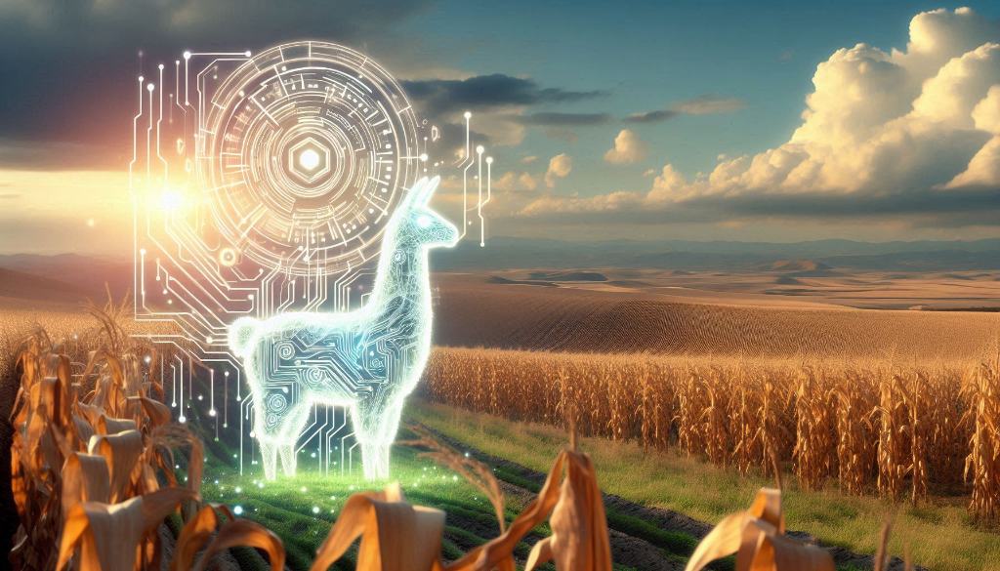
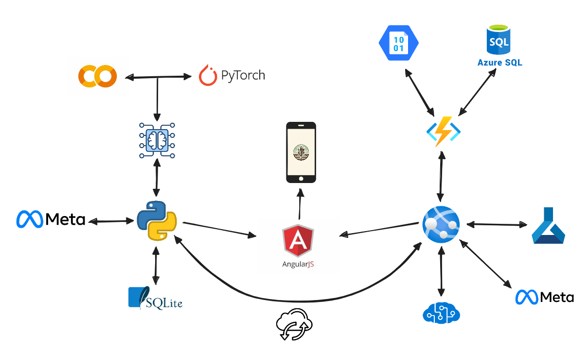

# 🌱 SeedLink AI: Cultivando el Futuro con Sabiduría Maya 🌽

**SeedLink AI** es una solución innovadora para la agricultura sostenible que combina inteligencia artificial y prácticas tradicionales mayas. Diseñada para funcionar tanto online como offline, SeedLink ofrece predicciones climáticas, recomendaciones agrícolas y un enfoque accesible para agricultores de todas las regiones.

---

## ✨ Características principales

### 🔗 **Online**
- **Predicciones climáticas avanzadas:** Modelos potentes en Azure para análisis precisos.
- **Recomendaciones personalizadas:** Basadas en la rotación de cultivos y datos históricos.
- **Sincronización en la nube:** Acceso a datos actualizados y almacenamiento histórico.

### 📶 **Offline**
- **Mapas sin conexión:** Localización y análisis de suelos directamente desde el dispositivo.
- **Predicción local:** Modelos ligeros optimizados para funcionar sin internet.
- **Calendario agrícola:** Herramienta que genera recomendaciones basadas en fechas y rotación de cultivos.

### 🌍 **Sostenibilidad**
- Prácticas inspiradas en la milpa maya, como la rotación de cultivos.
- Conservación de suelos y biodiversidad.
- Traducción y soporte en idiomas indígenas como K'iche'.

---

## 📊 Datos utilizados
- **Clima:** Datos históricos y predicciones obtenidos de Open-Meteo.
- **Suelos:** Mapas en formato .tif para análisis de calidad.
- **Cultivos:** Recomendaciones detalladas en archivos .csv.
- **Idiomas:** Soporte en K'iche’ para mejorar la accesibilidad.

---

## 💡 Tecnologías
- **Backend:** Java (PyTorch para Machine Learning).
- **Frontend:** Flutter para una interfaz intuitiva y funcional.
- **Modelos de IA:** Llama de Meta para procesamiento en lenguaje natural.
- **Nube:** Servicios de Azure para almacenamiento y entrenamiento continuo.

---

## 🎯 Roadmap del Proyecto
1. **Desarrollo del MVP:**
   - Implementación del modelo de predicción climática.
   - Creación de mapas offline y recomendaciones básicas.
2. **Expansión Online:**
   - Entrenamiento de modelos más robustos en Azure.
   - Sincronización con almacenamiento en la nube.
3. **Evolución del Proyecto:**
   - Traducción a otros idiomas indígenas.
   - Optimización de prácticas sostenibles basadas en datos.

---

## 🌟 Únete a la Revolución Agrícola
Con SeedLink, honramos el conocimiento ancestral mientras usamos tecnología para crear un futuro sostenible. ¡Sé parte del cambio!
